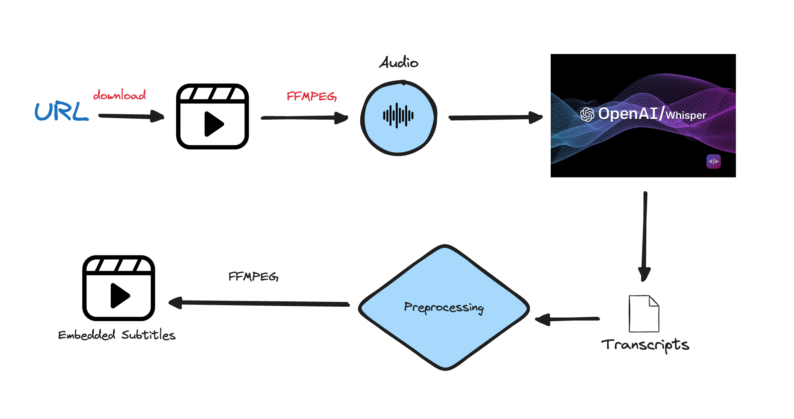

# Embedding Subtitles to Videos Automatically using Python, OpenAI Whisper, and FFMPEG

This project demonstrates how to automatically add subtitles to a video using Python, the OpenAI Whisper model for transcription, and FFMPEG for video processing. 

## Project Overview

The project follows these steps:
1. **Download a YouTube video** using the PyTube library.
2. **Extract audio from the video** using FFMPEG.
3. **Transcribe the audio** using the OpenAI Whisper model via the `faster-whisper` library.
4. **Format the transcription** into an SRT (SubRip Subtitle) file.
5. **Embed the subtitles** back into the video using FFMPEG, either as hard-burnt or soft subtitles.

## Visual Flow



## Installation

To run this project, you need to have Python installed along with the following dependencies:

- `pytube`
- `ffmpeg-python`
- `faster-whisper`

You can install these dependencies using `pip`:

```sh
pip install pytube ffmpeg-python faster-whisper
